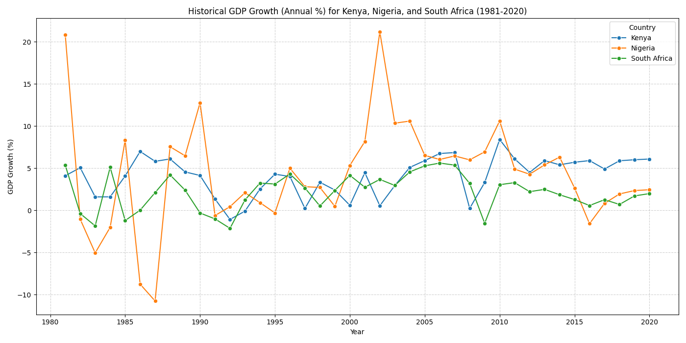
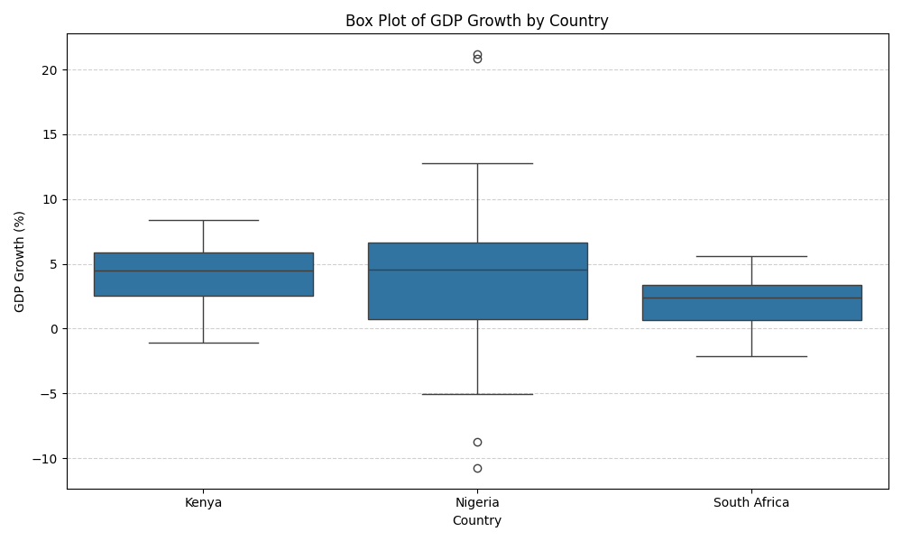

# Africa Economic Outlook: GDP Growth Forecasting MVP

This project is a Minimum Viable Product (MVP) for forecasting the GDP growth of key African economies. It uses a time-series forecasting model (Prophet) to predict annual GDP growth and presents the results in an interactive web application built with Streamlit.

## Project Overview

The primary goal of this project is to provide a simple yet effective tool for understanding and forecasting GDP growth in Kenya, Nigeria, and South Africa. The application allows users to:

- Visualize historical GDP growth trends.
- View a 5-year forecast (2021-2025) with confidence intervals.
- Analyze the performance of the forecasting model.
- Understand the key drivers of the GDP growth forecast.
- Compare economic performance across the selected countries.

## What to Expect

The main output of this project is a Streamlit dashboard. The dashboard is organized into several sections:

1. **Historical Trends and 5-Year Forecast**: An interactive chart showing historical GDP growth and the forecasted values for the selected country.
2. **Model Performance**: Key metrics (RMSE, MAE, MAPE) evaluating the model's accuracy on the test set (2016-2020).
3. **Feature Importance**: A bar chart showing the average absolute effect of different features (like inflation, fiscal balance, and trend) on the GDP growth forecast.
4. **Country Comparison and Key Insights**:
    - A table comparing model performance across all countries.
    - A line chart comparing historical GDP growth for all countries.
    - Textual insights from the Exploratory Data Analysis (EDA) and model performance.

### Visualizations

Here are some of a few of the visualizations you can expect from this project:

**Historical GDP Growth Comparison**


**GDP Growth Distribution by Country**


## Setup and Installation

To run this project, you need to have Python installed. You can set up the project using either `pip` with a virtual environment or `uv`.

### Using `uv` (Recommended)

`uv` is a fast Python package installer and resolver.

1. **Install `uv`**:

    ```bash
    pip install uv
    ```

2. **Create and activate a virtual environment**:

    ```bash
    uv venv
    source .venv/bin/activate  # On Windows, use `.venv\Scripts\activate`
    ```

3. **Install the dependencies**:

    ```bash
    uv pip install -r requirements.txt
    ```

### Using `pip`

1. **Create and activate a virtual environment**:

    ```bash
    python -m venv .venv
    source .venv/bin/activate  # On Windows, use `.venv\Scripts\activate`
    ```

2. **Install the dependencies**:

    ```bash
    pip install -r requirements.txt
    ```

## How to Run the Project

Once the setup is complete, you can run the data processing and modeling pipeline, and then launch the Streamlit application.

1. **Run the data pipeline and modeling scripts**:
    This will execute all the necessary data processing, analysis, and forecasting steps.

    ```bash
    python data_loader.py
    python data_prep.py
    python eda_and_viz.py
    python feature_split.py
    python forecasting_model.py
    python model_summary.py
    ```

2. **Launch the Streamlit application**:

    ```bash
    streamlit run app.py
    ```

    This will open the interactive dashboard in your web browser.

## Project Structure

The project is organized into several Python scripts, each responsible for a specific part of the workflow:

- `app.py`: The main Streamlit application file.
- `data_loader.py`: Loads the initial dataset and filters it for the target countries.
- `data_prep.py`: Cleans and prepares the GDP growth data for time-series analysis.
- `eda_and_viz.py`: Performs exploratory data analysis and generates visualizations.
- `feature_split.py`: Creates features (regressors) and splits the data into training and testing sets.
- `forecasting_model.py`: Builds and evaluates the Prophet forecasting model.
- `model_summary.py`: Summarizes the model performance and feature importance.
- `requirements.txt`: A list of Python dependencies for the project.
- `*.csv`: Data files generated and used throughout the project.
- `*.json`: Stores the forecasting results.
- `*.png`: Saved visualizations from the EDA.
- `*.txt`: Textual insights from the analysis.
